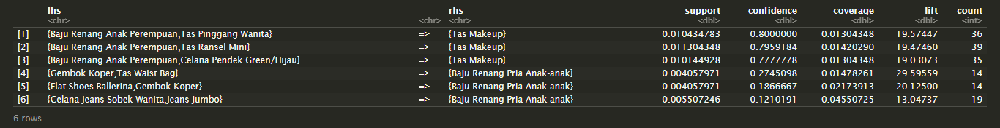

# Project Machine Learning for Retail with R

This is a project from DqLab that conducts basic data science on some simple retail data and machine learning to produce product package recommendations that can solve stock problems and increase sales.

## About Store

DQLab.id Fashion is a fashion shop that sells various products such as jeans, shirts, cosmetics, and others. Although it is quite developed, but with the increasing number of competitors and many products whose stocks are still large, it certainly worries DQLab.id Fashion managers.

One solution is to create innovative packages. Where products that were previously unsold but have market share can even be packaged and sold. 

## What We Need To Do

Several steps were taken to complete this project. First is prepare the library and download the required dataset. Then the raw data is cleaned up and scaled using standardization and normalization prior to modeling. And to realize this, using the `Apriori algorithm` of the `Arules` package throughout this project.

1. Get insight into the top 10 and bottom 10 of the products sold.
2. Get a list of all product package combinations with strong correlations.
3. Get a list of all product package combinations with specific items.

